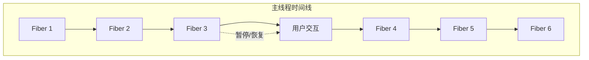
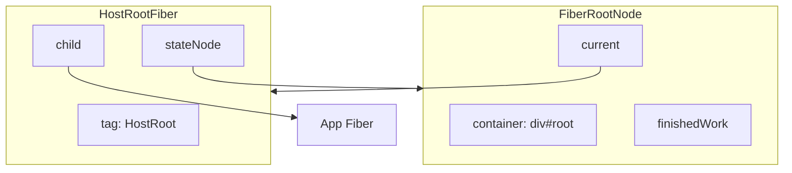
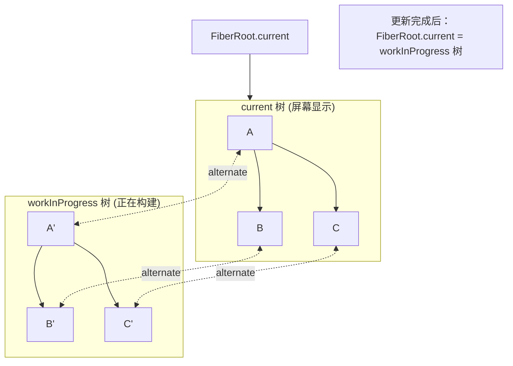
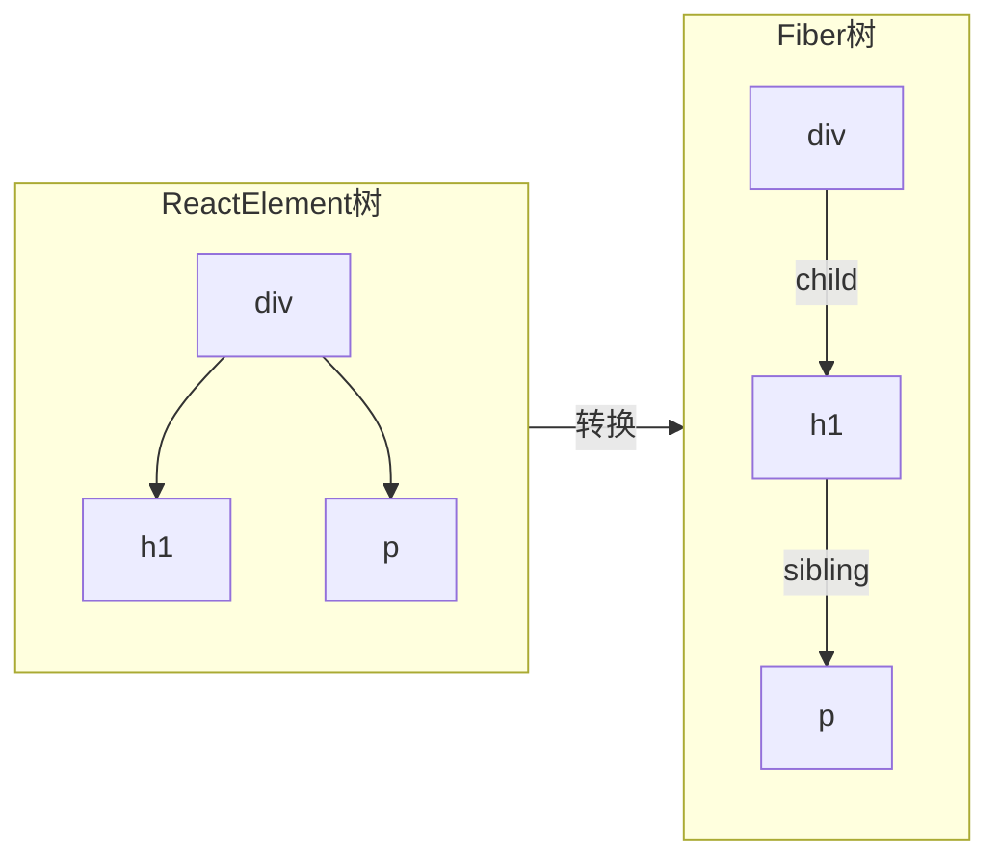
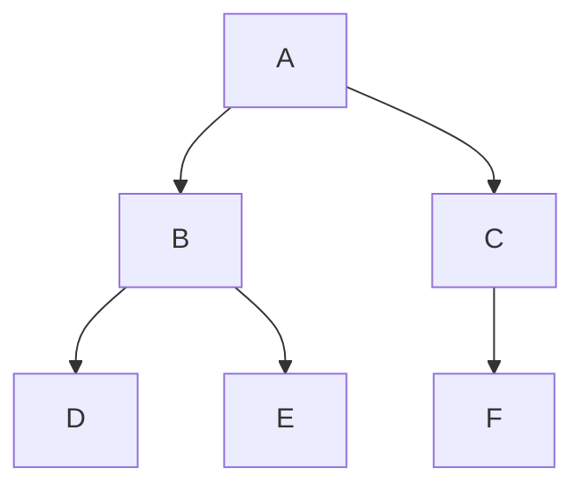

# 02 - Fiber 架构

Fiber 是 React 16 引入的新协调架构，是 React 并发模式的基础。本节深入理解 Fiber 数据结构和工作原理。

## 为什么需要 Fiber？

### 旧架构（Stack）的问题

React 15 及之前使用递归遍历 Virtual DOM：

```ts
// React 15 的更新方式
function updateComponent(component) {
  const element = component.render()
  const newVDOM = createVDOM(element)
  
  // 递归比较，无法中断
  diff(oldVDOM, newVDOM)
  
  // 递归更新子节点
  component.children.forEach(child => {
    updateComponent(child)
  })
}
```

**问题**：
- 同步递归，一旦开始无法停止
- 组件树很大时，阻塞主线程
- 动画、输入等高优先级任务被延迟
- 页面卡顿，用户体验差

### Fiber 的解决方案

将大任务拆分成小单元：



**优点**：
- 工作可分割成小单元
- 可暂停、恢复、中断
- 优先处理高优先级任务
- 保持 UI 响应

## Fiber 数据结构

### FiberNode

每个组件/DOM 元素对应一个 Fiber 节点：

```ts
class FiberNode {
  // ============ 标识 ============
  tag: WorkTag           // 工作类型（函数组件/原生DOM等）
  key: Key               // 列表渲染的 key
  type: any              // 元素类型（'div' 或组件函数）
  stateNode: any         // 对应的 DOM 节点或组件实例

  // ============ 树结构 ============
  return: FiberNode | null    // 父节点
  child: FiberNode | null     // 第一个子节点
  sibling: FiberNode | null   // 下一个兄弟节点
  index: number               // 在父节点中的索引

  // ============ 状态 ============
  pendingProps: Props         // 新的 props
  memoizedProps: Props        // 上次渲染的 props
  memoizedState: any          // Hooks 链表 或 state
  updateQueue: unknown        // 更新队列

  // ============ 副作用 ============
  flags: Flags                // 当前节点的副作用
  subtreeFlags: Flags         // 子树的副作用
  deletions: FiberNode[]      // 待删除的子节点

  // ============ 双缓冲 ============
  alternate: FiberNode | null // 指向另一棵树的对应节点
}
```

### WorkTag - 工作类型

```ts
const FunctionComponent = 0   // 函数组件
const ClassComponent = 1      // 类组件
const IndeterminateComponent = 2  // 尚未确定类型
const HostRoot = 3            // 根节点（FiberRoot）
const HostPortal = 4          // Portal
const HostComponent = 5       // 原生 DOM 元素
const HostText = 6            // 文本节点
const Fragment = 7            // Fragment
const Mode = 8                // StrictMode 等
const ContextConsumer = 9     // Context 消费者
const ContextProvider = 10    // Context 提供者
// ...更多类型
```

### Flags - 副作用标记

使用二进制位标记，可以组合多个标记：

```ts
// 基础标记
const NoFlags = 0b000000000000000
const PerformedWork = 0b000000000000001
const Placement = 0b000000000000010    // 插入
const Update = 0b000000000000100       // 更新
const Deletion = 0b000000000001000     // 删除
const ChildDeletion = 0b000000000010000 // 子节点删除

// 组合使用
let flags = Placement | Update  // 0b110 = 6
```

## FiberRootNode

整个应用的根节点：

```ts
class FiberRootNode {
  container: Container           // DOM 容器
  current: FiberNode             // 当前的 Fiber 树
  finishedWork: FiberNode | null // 已完成的 Fiber 树（待提交）
  
  // 并发模式相关
  pendingLanes: Lanes            // 待处理的优先级
  suspendedLanes: Lanes          // 暂停的优先级
  pingedLanes: Lanes             // 已唤醒的优先级
  
  // 其他
  callbackNode: any              // 调度的回调
  callbackPriority: Lane         // 回调优先级
}
```

### FiberRoot 与 HostRootFiber 的关系



## 双缓冲机制

React 维护两棵 Fiber 树：



### 为什么需要双缓冲？

1. **复用内存**：交替使用两棵树，避免每次都创建新对象
2. **回滚能力**：如果更新失败，可以回退到 current 树
3. **比较能力**：通过 `alternate` 指针，可以比较新旧节点

### createWorkInProgress

```ts
function createWorkInProgress(
  current: FiberNode,
  pendingProps: Props
): FiberNode {
  let workInProgress = current.alternate
  
  if (workInProgress === null) {
    // 首次渲染，创建新节点
    workInProgress = new FiberNode(current.tag, pendingProps, current.key)
    workInProgress.stateNode = current.stateNode
    
    // 建立双向链接
    workInProgress.alternate = current
    current.alternate = workInProgress
  } else {
    // 更新，复用节点
    workInProgress.pendingProps = pendingProps
    workInProgress.flags = NoFlags
    workInProgress.subtreeFlags = NoFlags
  }
  
  // 复制其他属性
  workInProgress.type = current.type
  workInProgress.updateQueue = current.updateQueue
  workInProgress.child = current.child
  workInProgress.memoizedProps = current.memoizedProps
  workInProgress.memoizedState = current.memoizedState
  
  return workInProgress
}
```

## Fiber 树的构建

### 从 ReactElement 到 Fiber



### Fiber 树的遍历

DFS 深度优先遍历：



遍历顺序: A → B → D → E → C → F

- **beginWork**: 入节点时执行
- **completeWork**: 出节点时执行

## 实现示例

### 定义 Fiber 节点

```ts
// fiber.ts
export class FiberNode {
  tag: WorkTag
  key: Key
  stateNode: any
  type: any
  
  return: FiberNode | null = null
  child: FiberNode | null = null
  sibling: FiberNode | null = null
  index: number = 0
  
  ref: Ref = null
  
  pendingProps: Props
  memoizedProps: Props | null = null
  memoizedState: any = null
  updateQueue: unknown = null
  
  alternate: FiberNode | null = null
  
  flags: Flags = NoFlags
  subtreeFlags: Flags = NoFlags
  deletions: FiberNode[] | null = null
  
  constructor(tag: WorkTag, pendingProps: Props, key: Key) {
    this.tag = tag
    this.key = key
    this.pendingProps = pendingProps
  }
}

export class FiberRootNode {
  container: Container
  current: FiberNode
  finishedWork: FiberNode | null = null
  
  constructor(container: Container, hostRootFiber: FiberNode) {
    this.container = container
    this.current = hostRootFiber
    hostRootFiber.stateNode = this
  }
}
```

### 创建 FiberRoot

```ts
function createFiberRoot(container: Container): FiberRootNode {
  // 创建 HostRoot Fiber
  const hostRootFiber = new FiberNode(HostRoot, {}, null)
  
  // 创建 FiberRoot
  const root = new FiberRootNode(container, hostRootFiber)
  
  return root
}
```

### 创建普通 Fiber

```ts
function createFiberFromElement(element: ReactElement): FiberNode {
  const { type, key, props } = element
  
  let tag: WorkTag
  
  if (typeof type === 'string') {
    // 原生 DOM 元素
    tag = HostComponent
  } else if (typeof type === 'function') {
    // 函数组件
    tag = FunctionComponent
  } else {
    // 其他类型...
    tag = IndeterminateComponent
  }
  
  const fiber = new FiberNode(tag, props, key)
  fiber.type = type
  
  return fiber
}
```

## 调试技巧

### 打印 Fiber 树结构

```ts
function printFiberTree(fiber: FiberNode, depth = 0) {
  const indent = '  '.repeat(depth)
  const tagName = typeof fiber.type === 'string' 
    ? fiber.type 
    : fiber.type?.name || `#${fiber.tag}`
  
  console.log(
    `${indent}${tagName}`,
    fiber.key ? `key="${fiber.key}"` : '',
    fiber.flags ? `flags=${fiber.flags.toString(2)}` : ''
  )
  
  if (fiber.child) {
    printFiberTree(fiber.child, depth + 1)
  }
  if (fiber.sibling) {
    printFiberTree(fiber.sibling, depth)
  }
}
```

### 追踪 Fiber 创建

```ts
let fiberId = 0

class FiberNode {
  _debugID: number
  
  constructor(...) {
    this._debugID = fiberId++
    console.log(`创建 Fiber #${this._debugID}`, this.type || this.tag)
  }
}
```

## 小结

1. **Fiber 是工作单元**：每个组件/DOM 对应一个 Fiber 节点
2. **树形结构**：通过 child/sibling/return 构成 Fiber 树
3. **双缓冲**：current 和 workInProgress 两棵树交替使用
4. **副作用标记**：用 flags 标记需要进行的 DOM 操作
5. **可中断**：工作拆分成小单元，支持暂停恢复

## 下一步

理解了 Fiber 架构后，下一步学习 [协调算法](./03-reconciliation.md)，了解 React 如何遍历 Fiber 树并计算差异。
