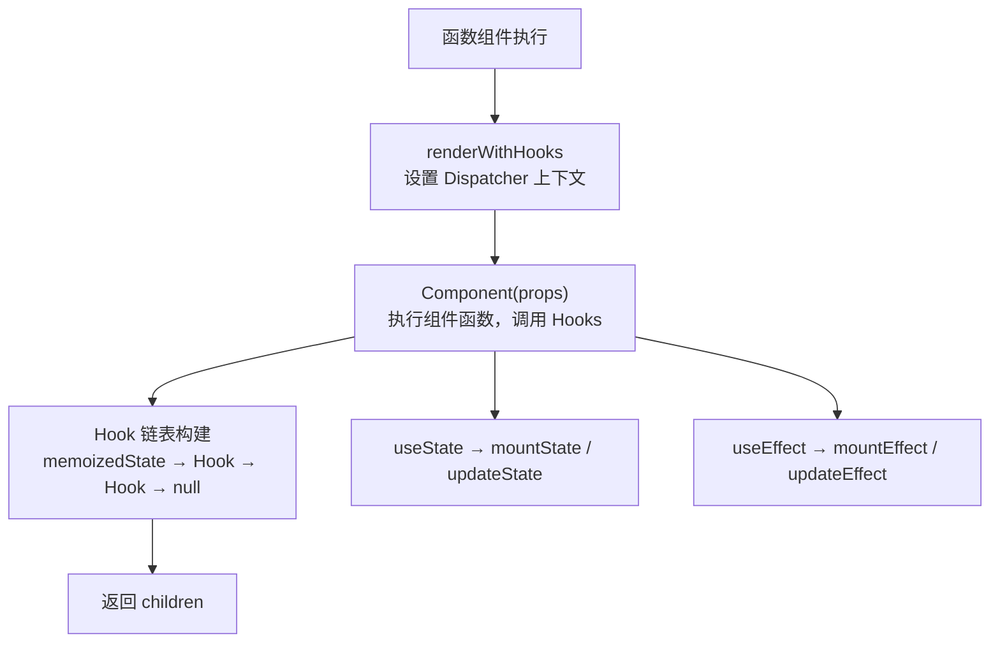
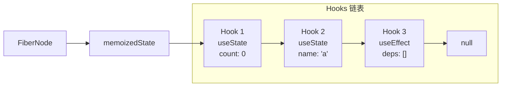
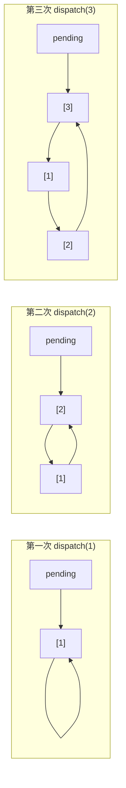

# 04 - Hooks 实现原理

Hooks 是 React 16.8 引入的特性，让函数组件也能拥有状态和生命周期。本节深入理解 Hooks 的内部实现机制。

## Hooks 架构概览



## Hook 数据结构

### Hook 类型定义

```ts
interface Hook {
  memoizedState: any       // 当前 Hook 的状态
  baseState: any           // 初始状态
  baseQueue: Update<any> | null  // 待处理的更新队列
  queue: UpdateQueue<any> | null  // 更新队列
  next: Hook | null        // 下一个 Hook
}
```

### 链表结构

Hooks 以链表形式存储在 Fiber.memoizedState 中：



**这就是为什么 Hooks 必须在顶层调用**：React 依赖调用顺序来匹配对应的 Hook。

## Dispatcher 模式

React 使用 Dispatcher 来区分 mount 和 update 阶段：

```ts
interface Dispatcher {
  useState: <S>(initialState: S | (() => S)) => [S, Dispatch<S>]
  useEffect: (create: EffectCallback, deps?: DependencyList) => void
  useMemo: <T>(factory: () => T, deps?: DependencyList) => T
  useCallback: <T extends Function>(callback: T, deps?: DependencyList) => T
  useRef: <T>(initialValue: T) => MutableRefObject<T>
  // ...更多 Hooks
}

// 当前 Dispatcher
const currentDispatcher: { current: Dispatcher | null } = {
  current: null
}

// Mount 阶段的 Dispatcher
const HookDispatcherOnMount: Dispatcher = {
  useState: mountState,
  useEffect: mountEffect,
  useMemo: mountMemo,
  useCallback: mountCallback,
  useRef: mountRef,
}

// Update 阶段的 Dispatcher
const HookDispatcherOnUpdate: Dispatcher = {
  useState: updateState,
  useEffect: updateEffect,
  useMemo: updateMemo,
  useCallback: updateCallback,
  useRef: updateRef,
}
```

## useState 实现

### 数据结构

```ts
type Action<State> = State | ((prevState: State) => State)
type Dispatch<State> = (action: Action<State>) => void

interface Update<State> {
  action: Action<State>
  next: Update<State> | null
}

interface UpdateQueue<State> {
  pending: Update<State> | null  // 环形链表
  dispatch: Dispatch<State> | null
}
```

### mountState

```ts
function mountState<S>(
  initialState: S | (() => S)
): [S, Dispatch<S>] {
  // 1. 创建 Hook 节点
  const hook = mountWorkInProgressHook()
  
  // 2. 初始化状态
  if (typeof initialState === 'function') {
    hook.memoizedState = (initialState as () => S)()
  } else {
    hook.memoizedState = initialState
  }
  
  // 3. 创建更新队列
  const queue: UpdateQueue<S> = {
    pending: null,
    dispatch: null
  }
  hook.queue = queue
  
  // 4. 创建 dispatch 函数
  const dispatch = dispatchSetState.bind(
    null,
    currentlyRenderingFiber,
    queue
  )
  queue.dispatch = dispatch
  
  // 5. 返回 [state, dispatch]
  return [hook.memoizedState, dispatch]
}
```

### updateState

```ts
function updateState<S>(
  initialState: S | (() => S)
): [S, Dispatch<S>] {
  // 1. 获取对应的 Hook
  const hook = updateWorkInProgressHook()
  
  // 2. 处理更新队列
  const queue = hook.queue
  const pending = queue.pending
  
  if (pending !== null) {
    // 计算新状态
    let newState = hook.memoizedState
    
    // 遍历环形链表，应用所有更新
    let update = pending
    do {
      const action = update.action
      if (typeof action === 'function') {
        newState = (action as (prev: S) => S)(newState)
      } else {
        newState = action
      }
      update = update.next!
    } while (update !== pending)
    
    // 更新状态
    hook.memoizedState = newState
    hook.baseState = newState
    queue.pending = null
  }
  
  return [hook.memoizedState, queue.dispatch!]
}
```

### dispatchSetState

```ts
function dispatchSetState<S>(
  fiber: FiberNode,
  queue: UpdateQueue<S>,
  action: Action<S>
) {
  // 1. 创建 Update
  const update: Update<S> = {
    action,
    next: null
  }
  
  // 2. 加入环形链表
  const pending = queue.pending
  if (pending === null) {
    // 第一个更新
    update.next = update  // 指向自己
  } else {
    // 插入到 pending 前面
    update.next = pending.next
    pending.next = update
  }
  queue.pending = update
  
  // 3. 调度更新
  scheduleUpdateOnFiber(fiber)
}
```

### 环形链表示意图



遍历顺序: pending(3) → 1 → 2 → 回到3停止

## Hook 链表管理

### mountWorkInProgressHook

```ts
let workInProgressHook: Hook | null = null
let currentlyRenderingFiber: FiberNode | null = null

function mountWorkInProgressHook(): Hook {
  const hook: Hook = {
    memoizedState: null,
    baseState: null,
    baseQueue: null,
    queue: null,
    next: null
  }
  
  if (workInProgressHook === null) {
    // 第一个 Hook
    currentlyRenderingFiber!.memoizedState = hook
    workInProgressHook = hook
  } else {
    // 后续 Hook，追加到链表
    workInProgressHook.next = hook
    workInProgressHook = hook
  }
  
  return workInProgressHook
}
```

### updateWorkInProgressHook

```ts
function updateWorkInProgressHook(): Hook {
  // 获取 current 树对应的 Hook
  const currentHook = currentHook
  let nextCurrentHook: Hook | null = null
  
  if (currentHook === null) {
    // 第一次进入 update
    const current = currentlyRenderingFiber!.alternate
    nextCurrentHook = current.memoizedState
  } else {
    nextCurrentHook = currentHook.next
  }
  
  // 创建或复用 workInProgress Hook
  let workInProgressHook: Hook | null = null
  
  if (workInProgressHook === null) {
    // 第一个 Hook
    workInProgressHook = {
      memoizedState: currentHook.memoizedState,
      baseState: currentHook.baseState,
      baseQueue: currentHook.baseQueue,
      queue: currentHook.queue,
      next: null
    }
    currentlyRenderingFiber!.memoizedState = workInProgressHook
  } else {
    // 复用并更新
    workInProgressHook.memoizedState = currentHook.memoizedState
    workInProgressHook.baseState = currentHook.baseState
    workInProgressHook.baseQueue = currentHook.baseQueue
    workInProgressHook.queue = currentHook.queue
    workInProgressHook.next = null
  }
  
  currentHook = nextCurrentHook
  return workInProgressHook
}
```

## useEffect 实现

### Effect 数据结构

```ts
interface Effect {
  tag: HookFlags          // 标记类型
  create: EffectCallback  // 副作用函数
  destroy: EffectCallback | void  // 清理函数
  deps: DependencyList    // 依赖数组
  next: Effect            // 下一个 Effect
}

type EffectCallback = () => void | (() => void)
type DependencyList = unknown[]

// Hook Flags
const HasEffect = 0b0001
const Layout = 0b0010
const Passive = 0b0100
```

### mountEffect

```ts
function mountEffect(
  create: EffectCallback,
  deps: DependencyList | undefined
) {
  const hook = mountWorkInProgressHook()
  const nextDeps = deps === undefined ? null : deps
  
  // 标记副作用
  currentlyRenderingFiber!.flags |= PassiveEffect
  
  hook.memoizedState = pushEffect(
    HasEffect | Passive,
    create,
    undefined,  // mount 时没有清理函数
    nextDeps
  )
}

function pushEffect(
  tag: HookFlags,
  create: EffectCallback,
  destroy: void | EffectCallback,
  deps: DependencyList | null
): Effect {
  const effect: Effect = {
    tag,
    create,
    destroy,
    deps,
    next: null
  }
  
  // 获取或创建 Effect 链表
  let componentUpdateQueue = currentlyRenderingFiber!.updateQueue
  
  if (componentUpdateQueue === null) {
    componentUpdateQueue = createFunctionComponentUpdateQueue()
    currentlyRenderingFiber!.updateQueue = componentUpdateQueue
  }
  
  // 添加到环形链表
  const lastEffect = componentUpdateQueue.lastEffect
  if (lastEffect === null) {
    effect.next = effect
    componentUpdateQueue.lastEffect = effect
  } else {
    const firstEffect = lastEffect.next
    lastEffect.next = effect
    effect.next = firstEffect
    componentUpdateQueue.lastEffect = effect
  }
  
  return effect
}
```

### updateEffect

```ts
function updateEffect(
  create: EffectCallback,
  deps: DependencyList | undefined
) {
  const hook = updateWorkInProgressHook()
  const nextDeps = deps === undefined ? null : deps
  
  const prevEffect = hook.memoizedState as Effect
  const prevDeps = prevEffect.deps
  
  // 比较依赖
  if (areHookInputsEqual(nextDeps, prevDeps)) {
    // 依赖未变，只推入 Effect 但不标记 HasEffect
    pushEffect(Passive, create, prevEffect.destroy, nextDeps)
    return
  }
  
  // 依赖改变，标记副作用
  currentlyRenderingFiber!.flags |= PassiveEffect
  hook.memoizedState = pushEffect(
    HasEffect | Passive,
    create,
    prevEffect.destroy,
    nextDeps
  )
}

function areHookInputsEqual(
  nextDeps: DependencyList | null,
  prevDeps: DependencyList | null
): boolean {
  if (prevDeps === null || nextDeps === null) {
    return false
  }
  
  if (nextDeps.length !== prevDeps.length) {
    return false
  }
  
  for (let i = 0; i < nextDeps.length; i++) {
    if (Object.is(nextDeps[i], prevDeps[i])) {
      continue
    }
    return false
  }
  
  return true
}
```

### 执行 Effect

在提交阶段执行：

```ts
function commitPassiveEffects(finishedWork: FiberNode) {
  commitPassiveEffectsOnFiber(finishedWork)
}

function commitPassiveEffectsOnFiber(fiber: FiberNode) {
  if (fiber.tag === FunctionComponent) {
    commitHookEffectList(Passive, HasEffect, fiber)
  }
}

function commitHookEffectList(
  flags: HookFlags,
  hookFlags: HookFlags,
  fiber: FiberNode
) {
  const updateQueue = fiber.updateQueue
  const lastEffect = updateQueue?.lastEffect
  
  if (lastEffect !== null) {
    let effect = lastEffect.next
    do {
      if ((effect.tag & flags) === flags && (effect.tag & hookFlags) === hookFlags) {
        // 执行清理函数
        const destroy = effect.destroy
        if (destroy !== undefined) {
          destroy()
        }
        
        // 执行副作用函数
        const create = effect.create
        effect.destroy = create()
      }
      effect = effect.next
    } while (effect !== lastEffect.next)
  }
}
```

## 其他 Hooks 实现

### useRef

```ts
function mountRef<T>(initialValue: T): MutableRefObject<T> {
  const hook = mountWorkInProgressHook()
  const ref = { current: initialValue }
  hook.memoizedState = ref
  return ref
}

function updateRef<T>(initialValue: T): MutableRefObject<T> {
  const hook = updateWorkInProgressHook()
  return hook.memoizedState
}
```

### useMemo

```ts
function mountMemo<T>(
  factory: () => T,
  deps: DependencyList | undefined
): T {
  const hook = mountWorkInProgressHook()
  const nextDeps = deps === undefined ? null : deps
  const nextValue = factory()
  hook.memoizedState = [nextValue, nextDeps]
  return nextValue
}

function updateMemo<T>(
  factory: () => T,
  deps: DependencyList | undefined
): T {
  const hook = updateWorkInProgressHook()
  const nextDeps = deps === undefined ? null : deps
  const prevState = hook.memoizedState as [T, DependencyList | null]
  
  if (areHookInputsEqual(nextDeps, prevState[1])) {
    return prevState[0]
  }
  
  const nextValue = factory()
  hook.memoizedState = [nextValue, nextDeps]
  return nextValue
}
```

### useCallback

```ts
function mountCallback<T extends Function>(
  callback: T,
  deps: DependencyList | undefined
): T {
  const hook = mountWorkInProgressHook()
  const nextDeps = deps === undefined ? null : deps
  hook.memoizedState = [callback, nextDeps]
  return callback
}

function updateCallback<T extends Function>(
  callback: T,
  deps: DependencyList | undefined
): T {
  const hook = updateWorkInProgressHook()
  const nextDeps = deps === undefined ? null : deps
  const prevState = hook.memoizedState as [T, DependencyList | null]
  
  if (areHookInputsEqual(nextDeps, prevState[1])) {
    return prevState[0]
  }
  
  hook.memoizedState = [callback, nextDeps]
  return callback
}
```

## Hooks 规则解析

### 规则一：只在顶层调用 Hooks

```tsx
// ❌ 错误：条件中调用
if (condition) {
  const [count, setCount] = useState(0)
}

// ❌ 错误：循环中调用
for (let i = 0; i < 3; i++) {
  const [value, setValue] = useState(i)
}

// ❌ 错误：嵌套函数中调用
function inner() {
  const [state, setState] = useState()
}

// ✅ 正确：顶层调用
const [count, setCount] = useState(0)
const [name, setName] = useState('')
```

**原因**：React 依赖调用顺序来匹配 Hook，条件语句会改变顺序。

### 规则二：只在 React 函数中调用

```tsx
// ❌ 错误：普通函数中调用
function handleClick() {
  const [count, setCount] = useState(0)  // Error!
}

// ❌ 错误：类组件中调用
class Component {
  method() {
    useState(0)  // Error!
  }
}

// ✅ 正确：函数组件中调用
function Component() {
  const [count, setCount] = useState(0)
}

// ✅ 正确：自定义 Hook 中调用
function useCustomHook() {
  const [state, setState] = useState()
  return state
}
```

## 闭包陷阱

### 问题示例

```tsx
function Counter() {
  const [count, setCount] = useState(0)
  
  useEffect(() => {
    const timer = setInterval(() => {
      console.log(count)  // 永远是 0！
      setCount(count + 1) // 永远是 1！
    }, 1000)
    return () => clearInterval(timer)
  }, [])  // 空依赖数组
  
  return <div>{count}</div>
}
```

### 解决方案

```tsx
// 方案1：添加依赖
useEffect(() => {
  const timer = setInterval(() => {
    setCount(count + 1)
  }, 1000)
  return () => clearInterval(timer)
}, [count])

// 方案2：使用函数式更新
useEffect(() => {
  const timer = setInterval(() => {
    setCount(c => c + 1)  // 总是获取最新值
  }, 1000)
  return () => clearInterval(timer)
}, [])

// 方案3：使用 useRef
const countRef = useRef(count)
countRef.current = count

useEffect(() => {
  const timer = setInterval(() => {
    console.log(countRef.current)  // 最新值
  }, 1000)
  return () => clearInterval(timer)
}, [])
```

## 实战练习

### 练习 1：实现 useReducer

```ts
function useReducer<S, A>(
  reducer: (state: S, action: A) => S,
  initialArg: S,
  init?: (arg: S) => S
): [S, Dispatch<A>] {
  // mount: 初始化状态
  // update: 处理 action 队列
}
```

### 练习 2：实现 useLayoutEffect

```ts
// 与 useEffect 类似，但在 mutation 阶段同步执行
function useLayoutEffect(
  create: EffectCallback,
  deps?: DependencyList
): void {
  // 标记 Layout effect
  // 在 commitMutationEffects 后同步执行
}
```

## 小结

1. **Hooks 链表**：存储在 Fiber.memoizedState，通过 next 链接
2. **Dispatcher**：区分 mount 和 update 阶段
3. **useState**：环形更新队列 + 函数式更新
4. **useEffect**：环形副作用链表 + 依赖比较
5. **规则原因**：顺序匹配机制
6. **闭包陷阱**：使用函数式更新或 useRef 解决

## 下一步

理解 Hooks 后，下一步学习 [调度器](./05-scheduler.md)，了解 React 如何实现时间切片和优先级调度。
