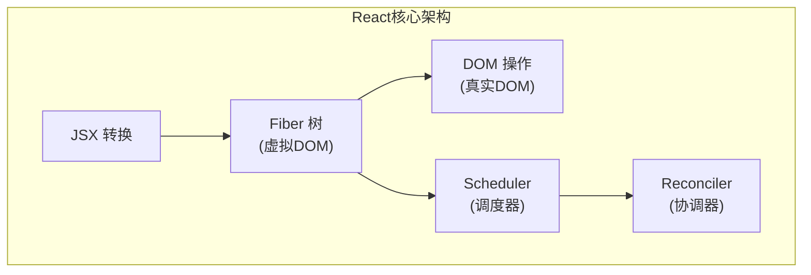
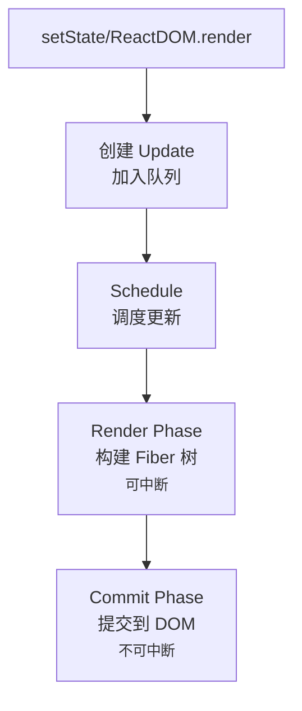

# React 实现学习指南

本指南帮助你从零开始理解 React 的核心原理，通过逐步实现来深入理解 Fiber 架构、Hooks 机制和协调算法。

## 学习路线



## 模块概览

| 序号 | 模块 | 文档 | 核心概念 |
|------|------|------|----------|
| 01 | JSX 转换 | [jsx.md](./tutorial/01-jsx.md) | ReactElement、createElement |
| 02 | Fiber 架构 | [fiber.md](./tutorial/02-fiber.md) | FiberNode、双缓冲、工作单元 |
| 03 | 协调算法 | [reconciliation.md](./tutorial/03-reconciliation.md) | beginWork、completeWork、Diff |
| 04 | Hooks 机制 | [hooks.md](./tutorial/04-hooks.md) | useState、链表结构、闭包陷阱 |
| 05 | 调度器 | [scheduler.md](./tutorial/05-scheduler.md) | 时间切片、优先级、中断恢复 |
| 06 | 事件系统 | [events.md](./tutorial/06-events.md) | 合成事件、事件委托 |

## 核心概念速查

### React 元素 vs Fiber 节点

```tsx
// React 元素 - 描述 UI 的不可变对象
const element = {
  $$typeof: Symbol.for('react.element'),
  type: 'div',
  key: null,
  ref: null,
  props: { children: 'Hello' }
}

// Fiber 节点 - 可变的工作单元
const fiber = {
  tag: HostComponent,      // 工作类型
  type: 'div',             // 元素类型
  key: null,
  stateNode: divElement,   // 对应的 DOM 节点
  
  // 树结构
  return: parentFiber,
  child: firstChildFiber,
  sibling: nextSiblingFiber,
  
  // 状态
  memoizedState: null,
  updateQueue: null,
  
  // 副作用
  flags: NoFlags,
  alternate: otherTreeFiber  // 双缓冲
}
```

### 更新流程



### 优先级与调度

React 的并发模式基于优先级调度：

| 优先级 | 含义 | 示例 |
|--------|------|------|
| Immediate | 立即执行 | 用户输入、焦点 |
| UserBlocking | 用户阻塞 | 点击、按键 |
| Normal | 正常 | 数据获取 |
| Low | 低优先级 | 分析、预加载 |
| Idle | 空闲 | 不重要任务 |

## 实现步骤

### 第一阶段：基础架构

1. **搭建项目结构**
   - 创建 monorepo 包结构
   - 配置 TypeScript 路径别名
   - 配置 Vite 构建

2. **实现 JSX 转换**
   - 实现 `jsx()` 函数
   - 定义 `ReactElement` 类型
   - 配置 Babel/JSX 编译

### 第二阶段：Fiber 核心

3. **实现 Fiber 数据结构**
   - 定义 `FiberNode` 类
   - 定义 `FiberRootNode` 类
   - 实现双缓冲机制

4. **实现工作循环**
   - 实现 `workLoop()`
   - 实现 `performUnitOfWork()`
   - 实现 DFS 遍历

### 第三阶段：协调与渲染

5. **实现协调算法**
   - 实现 `beginWork()` - 递阶段
   - 实现 `completeWork()` - 归阶段
   - 实现 Diff 算法

6. **实现 DOM 操作**
   - 实现 `hostConfig`
   - 实现 `completeWork` 中的 DOM 操作
   - 实现 `commitRoot`

### 第四阶段：状态管理

7. **实现 useState**
   - 实现 Hook 链表结构
   - 实现 UpdateQueue
   - 实现状态更新调度

### 第五阶段：优化

8. **实现调度器** (可选)
   - 使用 MessageChannel
   - 实现时间切片
   - 实现优先级队列

## 调试技巧

### 使用 React DevTools

```tsx
// 在代码中添加标记
fiber._debugSource = {
  fileName: 'App.tsx',
  lineNumber: 10
}
```

### 打印 Fiber 树

```tsx
function printFiberTree(fiber: FiberNode, indent = 0) {
  console.log(
    ' '.repeat(indent) + 
    `${fiber.type || fiber.tag} (${fiber.flags})`
  )
  if (fiber.child) printFiberTree(fiber.child, indent + 2)
  if (fiber.sibling) printFiberTree(fiber.sibling, indent)
}
```

### 追踪更新

```tsx
// 在 scheduleUpdateOnFiber 中添加
console.log('调度更新:', fiber, performance.now())
```

## 参考资源

### 官方资源

- [React 官方文档](https://react.dev/)
- [React GitHub 仓库](https://github.com/facebook/react)
- [React RFCs](https://github.com/reactjs/rfcs)

### 深入学习

- [React 技术揭秘](https://react.iamkasong.com/) - 卡颂
- [Inside React](https://www.nguyenhuythanh.com/series/inside-react) - Huy Thanh Nguyen
- [Dan Abramov 博客](https://overreacted.io/)

### 视频课程

- [自顶向下学 React 源码](https://ke.segmentfault.com/course/1650000023864436) - 推荐起步
- [手写 React 源码](https://wangfuyou.com/my-react/) - 实战导向

## 常见问题

### Q: 为什么要用 Fiber？

**A:** 旧版 Stack 架构是同步递归，无法中断，大组件会阻塞主线程导致卡顿。Fiber 将工作拆分成小单元，可以中断和恢复，实现时间切片。

### Q: 双缓冲是什么？

**A:** 维护两棵 Fiber 树：
- `current` 树：当前屏幕显示的内容
- `workInProgress` 树：正在构建的新树

更新完成后，两棵树交换指针，避免闪烁。

### Q: 为什么 Hooks 有顺序要求？

**A:** Hooks 以链表形式存储在 Fiber.memoizedState 中，React 通过调用顺序来匹配对应的 Hook。如果顺序变化，就会匹配错误。

### Q: 什么是合成事件？

**A:** React 自己实现的事件系统，所有事件委托到根节点，统一处理。优点：跨浏览器兼容、内存优化、支持池化。

## 下一步

准备好开始学习了吗？从 [JSX 转换](./tutorial/01-jsx.md) 开始你的 React 源码之旅！
