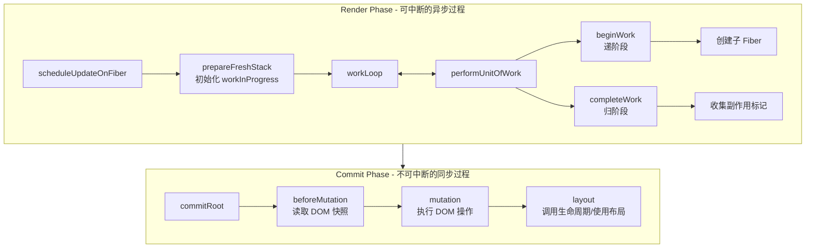

# 03 - 协调算法 (Reconciliation)

协调是 React 比较新旧 Fiber 树、计算差异的核心过程。本节深入理解 beginWork、completeWork 和 Diff 算法。

## 协调流程概览



## 工作循环 (workLoop)

### 核心实现

```ts
let workInProgress: FiberNode | null = null

function workLoop() {
  while (workInProgress !== null) {
    performUnitOfWork(workInProgress)
  }
}

function performUnitOfWork(fiber: FiberNode) {
  // 1. 处理当前节点，返回子节点
  const next = beginWork(fiber)
  
  // 2. 更新 memoizedProps
  fiber.memoizedProps = fiber.pendingProps
  
  if (next === null) {
    // 没有子节点，进入归阶段
    completeUnitOfWork(fiber)
  } else {
    // 有子节点，继续递阶段
    workInProgress = next
  }
}
```

### DFS 遍历示例

```
        A
       /|\
      B C D
     /|   |
    E F   G

遍历过程:
1. beginWork(A) → B    (入 A)
2. beginWork(B) → E    (入 B)
3. beginWork(E) → null (入 E)
4. completeWork(E)     (出 E)
5. B.sibling = F
6. beginWork(F) → null (入 F)
7. completeWork(F)     (出 F)
8. completeWork(B)     (出 B)
9. A.sibling = C
10. beginWork(C) → null (入 C)
11. completeWork(C)     (出 C)
12. A.sibling = D
13. beginWork(D) → G    (入 D)
14. beginWork(G) → null (入 G)
15. completeWork(G)     (出 G)
16. completeWork(D)     (出 D)
17. completeWork(A)     (出 A)
```

## beginWork - 递阶段

`beginWork` 处理当前 Fiber，创建/复用子 Fiber：

```ts
function beginWork(workInProgress: FiberNode): FiberNode | null {
  switch (workInProgress.tag) {
    case HostRoot:
      return updateHostRoot(workInProgress)
    case FunctionComponent:
      return updateFunctionComponent(workInProgress)
    case HostComponent:
      return updateHostComponent(workInProgress)
    case HostText:
      return null  // 文本节点没有子节点
    default:
      throw new Error(`未处理的 tag: ${workInProgress.tag}`)
  }
}
```

### updateHostRoot

根节点的更新：

```ts
function updateHostRoot(workInProgress: FiberNode): FiberNode | null {
  const baseState = workInProgress.memoizedState
  const updateQueue = workInProgress.updateQueue as UpdateQueue<Element>
  const pending = updateQueue.shared.pending
  
  // 处理更新队列
  const { memoizedState } = processUpdateQueue(baseState, pending)
  workInProgress.memoizedState = memoizedState
  
  // memoizedState 就是 ReactElement
  const nextChildren = memoizedState
  
  // 协调子节点
  return reconcileChildren(workInProgress, nextChildren)
}
```

### updateFunctionComponent

函数组件的更新：

```ts
function updateFunctionComponent(workInProgress: FiberNode): FiberNode | null {
  // 1. 准备 Hooks 上下文
  currentlyRenderingFiber = workInProgress
  workInProgress.memoizedState = null
  
  // 2. 设置 Dispatcher（mount 或 update）
  const current = workInProgress.alternate
  if (current !== null) {
    // update 阶段
    currentDispatcher.current = HookDispatcherOnUpdate
  } else {
    // mount 阶段
    currentDispatcher.current = HookDispatcherOnMount
  }
  
  // 3. 执行组件函数
  const Component = workInProgress.type
  const props = workInProgress.pendingProps
  const children = Component(props)
  
  // 4. 重置上下文
  currentlyRenderingFiber = null
  workInProgressHook = null
  
  // 5. 协调子节点
  return reconcileChildren(workInProgress, children)
}
```

### updateHostComponent

原生 DOM 元素的更新：

```ts
function updateHostComponent(workInProgress: FiberNode): FiberNode | null {
  const nextProps = workInProgress.pendingProps
  const nextChildren = nextProps.children
  
  return reconcileChildren(workInProgress, nextChildren)
}
```

## reconcileChildren - 子节点协调

核心的 Diff 算法入口：

```ts
function reconcileChildren(
  workInProgress: FiberNode,
  nextChildren: ReactElement | ReactElement[] | null
): FiberNode | null {
  const current = workInProgress.alternate
  
  if (current === null) {
    // mount：创建新的子 Fiber
    return mountChildFibers(workInProgress, nextChildren)
  } else {
    // update：复用或创建子 Fiber
    return reconcileChildFibers(workInProgress, current.child, nextChildren)
  }
}
```

## Diff 算法

React 的 Diff 算法基于三个假设：

1. **不同类型的元素**产生不同的树
2. 通过 **key** 标识哪些子元素是稳定的
3. **同级比较**，不跨层级比较

### 单节点 Diff

```ts
function reconcileSingleElement(
  returnFiber: FiberNode,
  currentFirstChild: FiberNode | null,
  element: ReactElement
): FiberNode {
  const key = element.key
  let child = currentFirstChild
  
  // 尝试复用现有节点
  while (child !== null) {
    if (child.key === key) {
      if (child.type === element.type) {
        // key 和 type 都匹配，可以复用
        const existing = useFiber(child, element.props)
        existing.return = returnFiber
        return existing
      }
      // key 匹配但 type 不匹配，删除现有节点
      deleteRemainingChildren(returnFiber, child)
      break
    } else {
      // key 不匹配，删除当前节点
      deleteChild(returnFiber, child)
    }
    child = child.sibling
  }
  
  // 无法复用，创建新节点
  const created = createFiberFromElement(element)
  created.return = returnFiber
  return created
}
```

### 多节点 Diff

React 使用双指针算法比较新旧子节点：

```ts
function reconcileChildrenArray(
  returnFiber: FiberNode,
  currentFirstChild: FiberNode | null,
  newChildren: ReactElement[]
): FiberNode {
  let oldFiber = currentFirstChild
  let newIdx = 0
  
  let previousNewFiber: FiberNode | null = null
  let resultingFirstChild: FiberNode | null = null
  
  // ===== 第一轮：处理更新的节点 =====
  for (; oldFiber !== null && newIdx < newChildren.length; newIdx++) {
    const newChild = newChildren[newIdx]
    
    if (oldFiber.key !== newChild.key || oldFiber.type !== newChild.type) {
      // key 或 type 不匹配，第一轮结束
      break
    }
    
    const newFiber = updateSlot(returnFiber, oldFiber, newChild)
    
    if (newFiber === null) {
      break
    }
    
    // 记录副作用
    newFiber.flags |= Update
    
    // 链接 Fiber
    if (previousNewFiber === null) {
      resultingFirstChild = newFiber
    } else {
      previousNewFiber.sibling = newFiber
    }
    previousNewFiber = newFiber
    oldFiber = oldFiber.sibling
  }
  
  // 新子节点已处理完，删除剩余旧节点
  if (newIdx === newChildren.length) {
    deleteRemainingChildren(returnFiber, oldFiber)
    return resultingFirstChild
  }
  
  // 旧子节点已处理完，创建剩余新节点
  if (oldFiber === null) {
    for (; newIdx < newChildren.length; newIdx++) {
      const newFiber = createFiberFromElement(newChildren[newIdx])
      newFiber.return = returnFiber
      
      if (previousNewFiber === null) {
        resultingFirstChild = newFiber
      } else {
        previousNewFiber.sibling = newFiber
      }
      previousNewFiber = newFiber
    }
    return resultingFirstChild
  }
  
  // ===== 第二轮：处理移动的节点 =====
  // 建立 key -> oldFiber 的映射
  const existingChildren = mapRemainingChildren(returnFiber, oldFiber)
  
  for (; newIdx < newChildren.length; newIdx++) {
    const newChild = newChildren[newIdx]
    const newFiber = updateFromMap(existingChildren, returnFiber, newChild)
    
    if (newFiber !== null) {
      if (newFiber.alternate !== null) {
        // 复用了现有节点，标记移动
        newFiber.flags |= Placement
      }
      
      if (previousNewFiber === null) {
        resultingFirstChild = newFiber
      } else {
        previousNewFiber.sibling = newFiber
      }
      previousNewFiber = newFiber
    }
  }
  
  return resultingFirstChild
}
```

### Diff 算法图示

```
旧: [A, B, C, D]
新: [A, C, D, B]

第一轮比较:
A vs A → 复用 ✓
B vs C → 不匹配，停止

建立 Map:
{ B: fiberB, C: fiberC, D: fiberD }

继续处理新列表:
C → 从 Map 找到，复用，标记 Placement
D → 从 Map 找到，复用，标记 Placement  
B → 从 Map 找到，复用，标记 Placement

最终操作: 移动 C, D, B
```

## completeWork - 归阶段

`completeWork` 在所有子节点处理完后执行，收集副作用：

```ts
function completeWork(workInProgress: FiberNode): FiberNode | null {
  const current = workInProgress.alternate
  const newProps = workInProgress.pendingProps
  
  switch (workInProgress.tag) {
    case HostRoot:
      // 根节点，无需处理
      return null
      
    case HostComponent: {
      const type = workInProgress.type
      
      if (current !== null && workInProgress.stateNode !== null) {
        // update: 更新属性
        updateHostComponent(current, workInProgress, newProps)
      } else {
        // mount: 创建 DOM 节点
        const instance = createInstance(type, newProps)
        workInProgress.stateNode = instance
        
        // 将子节点挂载到当前节点
        appendAllChildren(instance, workInProgress)
      }
      return null
    }
    
    case HostText: {
      const newText = newProps
      
      if (current !== null && workInProgress.stateNode !== null) {
        // update: 更新文本
        const oldText = current.memoizedProps
        if (oldText !== newText) {
          markUpdate(workInProgress)
        }
      } else {
        // mount: 创建文本节点
        workInProgress.stateNode = createTextNode(newText)
      }
      return null
    }
    
    default:
      throw new Error(`未处理的 tag: ${workInProgress.tag}`)
  }
}
```

### 收集副作用

```ts
function completeUnitOfWork(fiber: FiberNode) {
  let node: FiberNode | null = fiber
  
  do {
    // 处理当前节点
    completeWork(node)
    
    // 向上冒泡副作用标记
    const parent = node.return
    if (parent !== null) {
      // 合并子树副作用
      if (parent.subtreeFlags === NoFlags) {
        parent.subtreeFlags = node.subtreeFlags | node.flags
      } else {
        parent.subtreeFlags |= node.subtreeFlags | node.flags
      }
      
      // 收集待删除的节点
      if (node.deletions !== null) {
        if (parent.deletions === null) {
          parent.deletions = node.deletions
        } else {
          parent.deletions.push(...node.deletions)
        }
      }
    }
    
    // 处理兄弟节点
    if (node.sibling !== null) {
      workInProgress = node.sibling
      return
    }
    
    // 向上返回
    node = parent
  } while (node !== null)
  
  workInProgress = null
}
```

## commitRoot - 提交阶段

提交阶段不可中断，执行真正的 DOM 操作：

```ts
function commitRoot(root: FiberRootNode) {
  const finishedWork = root.finishedWork
  
  if (finishedWork === null) return
  
  // 重置
  root.finishedWork = null
  
  // 收集副作用
  const subtreeHasEffects = (finishedWork.subtreeFlags & MutationMask) !== NoFlags
  const rootHasEffect = (finishedWork.flags & MutationMask) !== NoFlags
  
  if (subtreeHasEffects || rootHasEffect) {
    // 阶段1: beforeMutation
    commitBeforeMutationEffects(finishedWork)
    
    // 阶段2: mutation（DOM 操作）
    commitMutationEffects(finishedWork, root)
    
    // 阶段3: layout
    commitLayoutEffects(finishedWork)
  }
  
  // 切换 current 指针
  root.current = finishedWork
}
```

### commitMutationEffects

```ts
function commitMutationEffects(
  finishedWork: FiberNode,
  root: FiberRootNode
) {
  commitMutationEffectsOnFiber(finishedWork, root)
}

function commitMutationEffectsOnFiber(
  fiber: FiberNode,
  root: FiberRootNode
) {
  const flags = fiber.flags
  
  if (flags & Placement) {
    // 插入节点
    commitPlacement(fiber)
    fiber.flags &= ~Placement
  }
  
  if (flags & Update) {
    // 更新节点
    commitUpdate(fiber)
    fiber.flags &= ~Update
  }
  
  if (flags & ChildDeletion) {
    // 删除子节点
    const deletions = fiber.deletions
    if (deletions !== null) {
      deletions.forEach(child => {
        commitDeletion(child, root)
      })
    }
    fiber.flags &= ~ChildDeletion
  }
  
  // 递归处理子节点
  if (fiber.child !== null) {
    commitMutationEffectsOnFiber(fiber.child, root)
  }
  
  // 处理兄弟节点
  if (fiber.sibling !== null) {
    commitMutationEffectsOnFiber(fiber.sibling, root)
  }
}
```

## 实现示例

### 完整的协调流程

```ts
// 更新队列处理
function processUpdateQueue<State>(
  baseState: State,
  pendingUpdate: Update<State> | null
): { memoizedState: State } {
  if (pendingUpdate === null) {
    return { memoizedState: baseState }
  }
  
  const action = pendingUpdate.action
  
  if (typeof action === 'function') {
    return { memoizedState: action(baseState) }
  }
  
  return { memoizedState: action }
}

// 创建 DOM 实例
function createInstance(type: string, props: Props): Instance {
  const element = document.createElement(type)
  
  // 设置属性
  for (const key in props) {
    if (key !== 'children') {
      element.setAttribute(key, props[key])
    }
  }
  
  return element
}

// 挂载子节点
function appendAllChildren(parent: Instance, fiber: FiberNode) {
  let node = fiber.child
  
  while (node !== null) {
    if (node.tag === HostComponent || node.tag === HostText) {
      // 直接子节点，挂载
      appendChild(parent, node.stateNode)
    } else if (node.child !== null) {
      // 非原生节点，继续向下查找
      node.child.return = node
      node = node.child
      continue
    }
    
    // 向上回溯
    while (node !== fiber && node.sibling === null) {
      node = node.return
    }
    
    if (node !== fiber) {
      node = node.sibling
    }
  }
}
```

## 小结

1. **协调流程**：beginWork（递）→ completeWork（归）
2. **Diff 算法**：同级比较、key 识别、双指针
3. **副作用收集**：向上冒泡 flags 和 deletions
4. **提交阶段**：beforeMutation → mutation → layout
5. **双缓冲切换**：提交后切换 current 指针

## 下一步

理解协调算法后，下一步学习 [Hooks 实现原理](./04-hooks.md)，了解 React 状态管理的内部机制。
